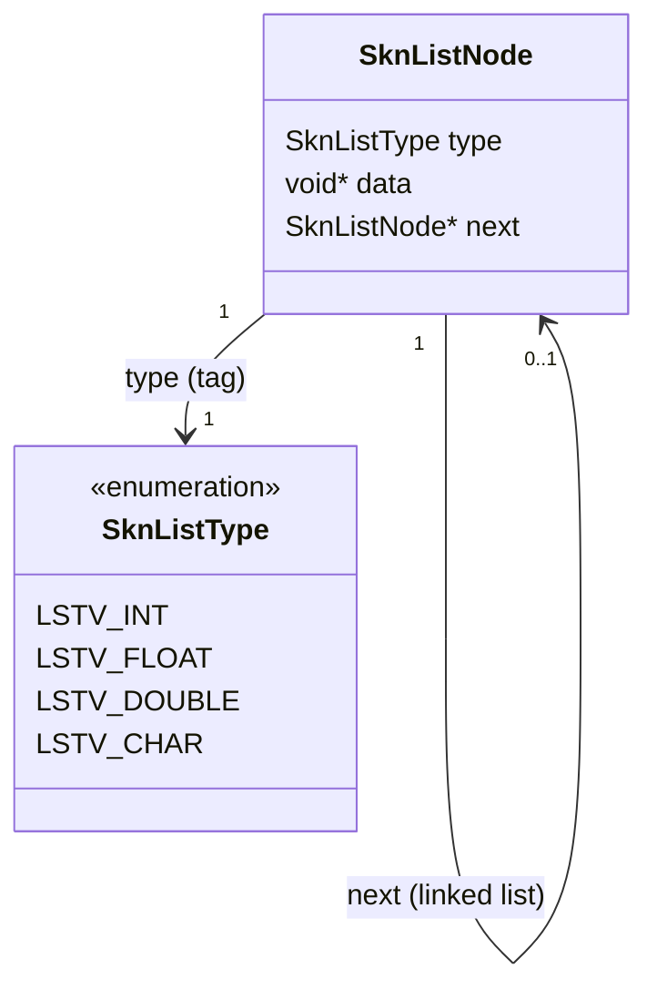
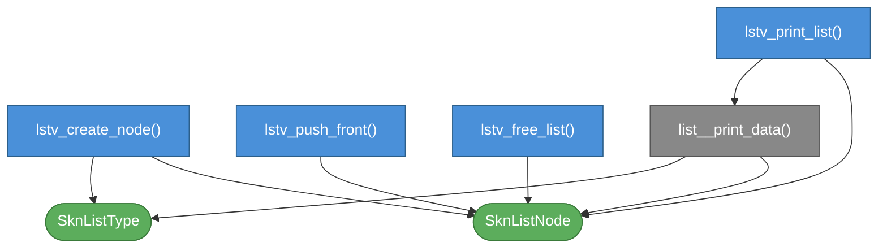

# skn_list.h

Header-only, non-owning tagged linked list ("list viewer"). Drop `skn_list.h` into your project and include it.

---

## Concept

Each node stores a type tag and a `void*` pointing at an **external, caller-owned** variable — the data is never copied. Build a row of nodes once, then in a loop mutate the referenced variables and reprint the row without ever rebuilding the list. Intended for incremental/streaming tabular output — e.g. a live log row whose fields are pointers into your working variables.

Nodes do **not** own the data they point to: `lstv_free_list` only frees the nodes themselves, never the pointed-to variables.

This is a distinct concept from `skinny-reader/skn_dat.h`'s `DatList`/`DatListNode`, which hold parsed, *owned* list values inside a `.dat` document — no overlap.

### Supported types

| Constant | C type |
|---|---|
| `LSTV_INT` | `int` |
| `LSTV_FLOAT` | `float` |
| `LSTV_DOUBLE` | `double` |
| `LSTV_CHAR` | `char*` (string) |

---

## Usage

```c
#define SKN_LIST_IMPLEMENTATION
#include "skn_list.h"

int   v_int   = 0;
float v_float = 0.0f;

SknListNode *row = NULL;
lstv_push_front(&row, lstv_create_node(LSTV_FLOAT, &v_float));
lstv_push_front(&row, lstv_create_node(LSTV_INT,   &v_int));

for (v_int = 0; v_int < 3; v_int++) {
    v_float = v_int * 0.5f;
    lstv_print_list(stdout, row, ", ", 1);
}
lstv_free_list(row);
```

Define `SKN_LIST_IMPLEMENTATION` in **exactly one** translation unit before the include.

`lstv_create_node` returns `NULL` on allocation failure. `lstv_push_front` treats a `NULL` node as a safe no-op — the list is left unchanged and `-1` is returned — so `lstv_push_front(&row, lstv_create_node(...))` never dereferences a null pointer, even under OOM.

---

## Public API

### `lstv_create_node`
```c
SknListNode *lstv_create_node(SknListType type, void *addr);
```
Creates a node of the given type pointing at `addr` (not copied — `addr` must outlive the node). Returns `NULL` on allocation failure.

### `lstv_push_front`
```c
int lstv_push_front(SknListNode **head, SknListNode *node);
```
Pushes `node` onto the front of `*head`. If `node` is `NULL`, this is a safe no-op: `*head` is left unchanged and `-1` is returned. Returns `0` on success.

### `lstv_free_list`
```c
void lstv_free_list(SknListNode *head);
```
Frees every node in the list. Only the nodes are freed — the variables they point to are untouched. Safe to call with `NULL`.

### `lstv_print_list`
```c
int lstv_print_list(FILE *fp, SknListNode *list, const char *sep, int new_line);
```
Prints the current values of every node in `list` to `fp`, in order, separated by `sep` (may be `NULL` for no separator). If `new_line` is non-zero, a trailing newline is printed after the last value. Returns `1` on success, `-1` if a node has a `NULL` data pointer or an unrecognized type.

---

## Data model



---

## Function dependency map

Colors: **blue** = public API · **grey** = internal · **green** = data types.


