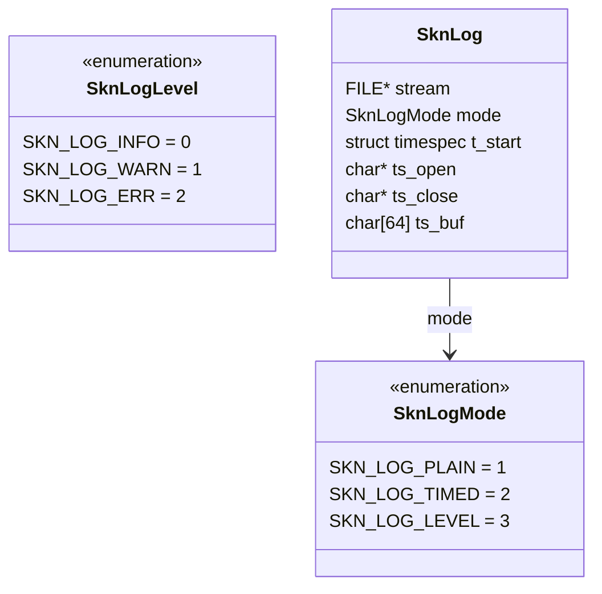
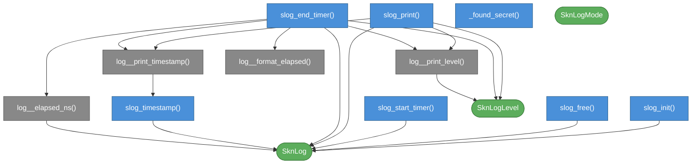

# skn_log.h

Header-only logger. Drop `skn_log.h` into your project and include it.

---

## Modes

| Constant | Prefix emitted |
|---|---|
| `SKN_LOG_PLAIN` | *(none)* |
| `SKN_LOG_TIMED` | `[YYYY-MM-DD HH:mm:ss]` |
| `SKN_LOG_LEVEL` | `[YYYY-MM-DD HH:mm:ss] INFO/WARNING/ERROR -` |

---

## Usage

```c
#define SKN_LOG_IMPLEMENTATION
#include "skn_log.h"

SknLog *log = slog_init(SKN_LOG_LEVEL, stdout, NULL, NULL);
slog_print(log, SKN_LOG_INFO, "starting\n");
slog_start_timer(log);
do_work();
slog_end_timer(log, SKN_LOG_INFO, "done in %t\n");
slog_free(log);
```

Define `SKN_LOG_IMPLEMENTATION` in **exactly one** translation unit.

`slog_init`'s last two arguments are the timestamp delimiters (default
`"["` / `"]"`); pass `NULL` for either to keep the default, or a custom
pair (e.g. `"<"`, `">"`) to change how every timestamp is wrapped.
`slog_timestamp(log)` formats the current time with those delimiters into
a buffer owned by `log` and returns it, for callers who want the
timestamp string directly rather than only the automatic prefix that
`slog_print`/`slog_end_timer` add in TIMED/LEVEL modes.

---

## Data model



---

## Function dependency map

Colors: **blue** = public API · **grey** = internal · **green** = data types.


